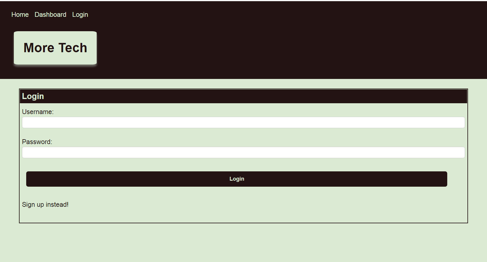
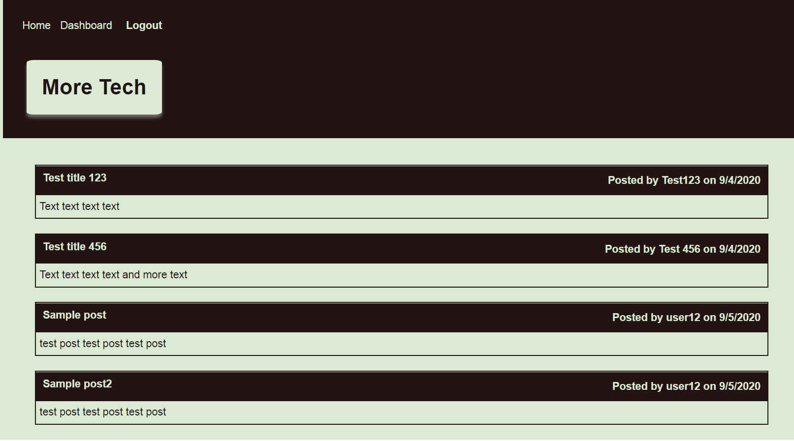
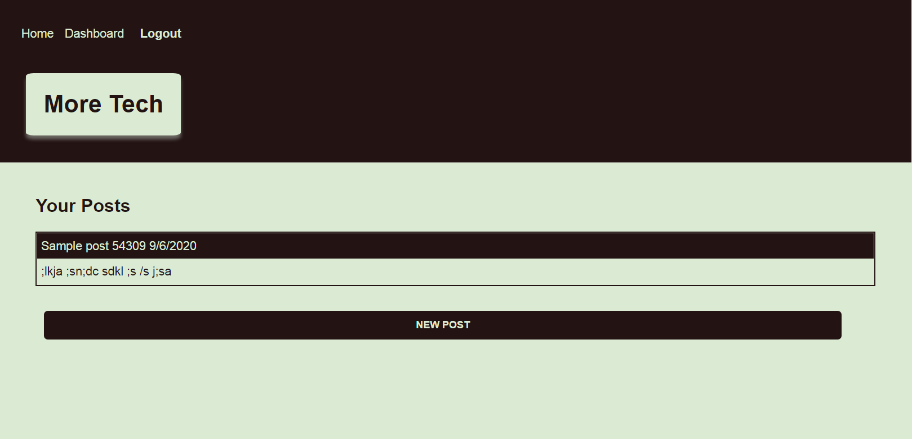

# More Tech Blog Site

## [Deployed link](https://lit-springs-36043.herokuapp.com/)

## Description
The More Tech blog site is a content management system for tech content. Visitors can review tech-based blog posts, add comments, or post their own content.
  
## Table of Contents
* [Installation](#installation)
* [Usage](#usage)
* [License](#license)
* [Questions](#questions)
 
## Installation
Clone the repo and run NPM install.

## Usage
Upon first visiting the site, users are prompted to log-in or sign-up for an account. Once they are logged in, they can view all posts on the Home Page, or view their own posts on the Dashboard.

Users can also add comments to existing posts, add a new post, or edit their existing posts by clicking on a post.

## License
This project is licensed under a ISC License license. 

## Contributing
na

## Tests
na

## Questions
Have additional questions? Contact [cjacktwil](http://github.com.cjacktwil) or email traceyjackson112@gmail.com.
